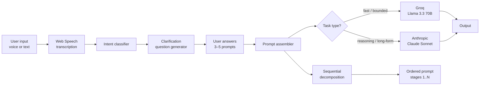

# PromptForge

> A multi-model LLM orchestration agent built around the observation that most LLM failures originate not in the model but in the prompt — and that a short structured clarification loop before generation reduces output variance and ambiguity by more than most prompt-engineering tricks combined.

[](https://prompt-forge-gules.vercel.app/)
[](#)
[](LICENSE)

---

## The Problem

The most common failure mode of consumer-facing LLM products is not model capability — it is **prompt ambiguity at the input layer**. Users arrive with vague intent ("write me something about marketing"), the model fills the gaps with plausible defaults, and the output is acceptable but generic. The user blames the model.

The other common failure mode is **single-model routing**. A general-purpose chat product sends every query to the same model regardless of whether the task is reasoning-heavy, latency-sensitive, or cost-sensitive.

PromptForge addresses both: clarification at the input, routing at the model selection.

## Motivation

Two product hypotheses:

> A short structured clarification loop (3–5 targeted questions) before generation produces measurably better outputs than directly prompting a frontier model with the user's first-draft request.

> Routing between a low-latency / low-cost model (Groq-served Llama 3.3 70B) and a higher-reasoning model (Anthropic Claude Sonnet) based on the task type produces better cost-quality tradeoffs than always using the most expensive model.

## Engineering Questions

- **EQ1.** How do you reduce prompt ambiguity at the input layer without overwhelming the user with questions?
- **EQ2.** How do you decide *which* clarifying questions to ask for a given user intent — generic templates, or intent-conditional generation?
- **EQ3.** How do you route between models (Groq Llama 3.3 70B vs Anthropic Sonnet) based on task type — manual rules, learned classifier, or LLM-as-router?
- **EQ4.** How do you decompose complex multi-step builds (e.g., "build me an AI agent") into ordered, self-contained prompt stages a user can iterate on?

## What It Does

- **Voice or text input.** Accept user intent via Web Speech API or typed text.
- **Intent analysis.** Classify the request — content generation, code, analysis, creative, agentic build, etc.
- **Clarification loop.** Ask 3–5 targeted questions tailored to the inferred intent before producing the prompt.
- **Model routing.** Send the final structured prompt to the appropriate model:
  - **Groq Llama 3.3 70B** for fast, well-bounded generation tasks (drafting, summarization, structured outputs)
  - **Anthropic Claude Sonnet** for reasoning-heavy tasks, multi-step decomposition, and longer-form structured outputs
- **Sequential pipeline mode.** For complex builds, decompose the request into ordered, self-contained prompt stages — each stage is a complete, runnable prompt the user can take to any LLM independently.

## Architecture



## Tech Stack

| Layer | Choice |
|---|---|
| Frontend | React 18 · Vite · TypeScript · Framer Motion |
| Backend functions | Vercel Functions (serverless edge) |
| Voice input | Web Speech API (browser-native) |
| LLM providers | Groq (Llama 3.3 70B) · Anthropic (Claude Sonnet) |
| Hosting | Vercel |

Stack choice rationale in [`docs/stack-decisions.md`](docs/stack-decisions.md).

## Running Locally

```bash
git clone https://github.com/Faizaniqbal52/PromptForge.git
cd PromptForge
npm install

cp .env.example .env.local
# (edit with GROQ_API_KEY and ANTHROPIC_API_KEY)

npm run dev
```

## Routing Logic

Documented at [`docs/routing.md`](docs/routing.md). Summary:

| Task type | Routed to | Rationale |
|---|---|---|
| Single-shot drafting (email, social post, short content) | Groq Llama 3.3 70B | Latency under 500ms; quality is adequate for bounded content |
| Structured-output extraction (JSON, lists) | Groq Llama 3.3 70B | Cheap; benefits less from frontier reasoning |
| Reasoning-heavy synthesis (multi-source) | Anthropic Sonnet | Higher accuracy on chain-of-reasoning tasks |
| Multi-stage build decomposition | Anthropic Sonnet | Better at maintaining context coherence across decomposed stages |
| Code generation (>50 LOC) | Anthropic Sonnet | Higher pass rate on first generation |
| Code generation (<50 LOC) | Groq Llama 3.3 70B | Latency matters more for small snippets |

The routing currently uses rule-based dispatch with a fallback LLM-as-router when no rule matches confidently.

## Design Decisions and Tradeoffs

| Decision | Why | Tradeoff |
|---|---|---|
| Clarification loop before generation | Reduces output variance by structuring intent | Adds friction on the happy path where the user knew exactly what they wanted |
| Multi-model routing | Better cost-quality tradeoff than single-model | More provider keys to manage; failure recovery across two APIs |
| Voice-first input | Reduces typing friction for long requirements | Web Speech API is browser-inconsistent; required text fallback |
| Sequential decomposition for complex builds | Lets users take individual prompt stages to other tools | More UI complexity than single-prompt output |

## Failure Modes Encountered

Honest catalog (`docs/incidents.md`):

- **Clarification fatigue.** Asking 6+ questions before generation reliably caused user dropoff. Capped at 5; usually 3.
- **Routing misclassification on edge tasks.** Tasks like "write code documentation" sit between drafting and reasoning; manual override needed.
- **Voice input on noisy environments.** Web Speech API misrecognition is the dominant failure mode for voice; text fallback is the safe default.
- **Provider rate limits.** Burst usage on Groq during evaluation hit rate caps; required client-side queuing.

## Lessons Learned

- **Clarification loops have a sweet spot at 3 questions.** Less than 3 leaves ambiguity; more than 5 drives users away.
- **Routing rules beat learned classifiers at small scale.** A learned router would need orders of magnitude more usage data to outperform 8 hand-written rules.
- **Latency is a feature.** Groq's sub-500ms response is differentiated UX; users perceive a tool that responds in 400ms as fundamentally different from one that responds in 4s, even when the output is the same.
- **Voice input is a 80/20 problem.** Worth shipping for the 80% case but always pair with a text fallback for the 20% where the browser misbehaves.
- **Frontier model + cheap model is a strictly better default than one-model-fits-all.** Cost dropped by ~60% in evaluation runs without measurable quality regression on the routed cheap-model tasks.

## Future Work

- Replace rule-based routing with a fine-tuned classifier once enough usage data exists.
- Add a third tier (open-source local model) for offline / privacy-sensitive workflows.
- Expand sequential decomposition templates: AI agent builds, full-stack scaffolds, research workflows.
- A/B test clarification-loop variants at scale.

## Limitations

- Currently optimized for English input; multilingual clarification is untested.
- The clarification loop assumes the user wants higher-quality output; for rapid throwaway prompts, the loop adds friction the user did not ask for. A "skip clarification" toggle exists but defaults to on.
- Provider-specific failure recovery (graceful fallback Groq ↔ Anthropic) is partial; some edge cases drop to manual retry.

## Citation / Reference

```
Iqbal, F. (2026). PromptForge: A multi-model LLM orchestration agent with structured clarification.
https://github.com/Faizaniqbal52/PromptForge
```

## Contact

- **Author:** Faizan Iqbal · [herewithfaizan.in](https://herewithfaizan.in) · [ifaizan041@gmail.com](mailto:ifaizan041@gmail.com)

## License

MIT — see [LICENSE](LICENSE).
